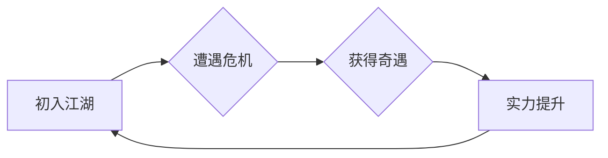

# 卷一：东海风云 - 章节设计

本卷主要围绕主角龙傲天初入江湖，在东海区域结识盟友、遭遇宿敌，并最终揭开“苍龙七宿”秘密一角的序幕。

> **创作笔记**: 本卷的重点是快节奏的奇遇和人物关系的建立，为后续更宏大的世界观铺垫。


## 章节大纲

### 流程图：龙傲天成长路径


| 章节 | 标题 | 核心事件 | 出场角色 | 关键场景/物品 | 备注 |
|---|---|---|---|---|---|
| 1.1 | 孤舟少年 | 龙傲天乘孤舟抵达临海镇，初遇赵日天。 | - **龙傲天** (主角)<br>- 赵日天 (挚友) | 临海镇码头、海鲜酒楼 | 奠定本卷轻松诙谐的基调。 |
| 1.2 | 不打不相识 | 龙傲天与赵日天因误会大打出手，结为兄弟。 | - 龙傲天<br>- 赵日天 | 镇外乱石岗 | 展示龙傲天的剑法和赵日天的拳法。 |
| 1.3 | 黑风寨之危 | 黑风寨山贼袭扰临海镇，掳走镇长之女。 | - 龙傲天<br>- 赵日天<br>- 黑风寨主 (反派) | 临海镇、黑风寨 | 引入第一个小冲突，主角团首次合作。 |
| 1.4 | 夜探黑风寨 | 龙傲天与赵日天潜入黑风寨，发现其与北冥魔殿有关。 | - 龙傲天<br>- 赵日天 | 黑风寨地牢 | 获得关键物品：**北冥令牌**。 |
| 1.5 | 决战黑风寨 | 主角团与黑风寨决战，救出人质，叶良辰首次登场。 | - 龙傲天<br>- 赵日天<br>- **叶良辰** (宿敌) | 黑风寨聚义厅 | 叶良辰以压倒性实力击败黑风寨主，带走令牌，与龙傲天结下梁子。 |

## 核心设定：苍龙七宿

“苍龙七宿”是流传于东海之上的古老传说，与七件上古神器及星辰之力有关。

- **设定细节**:
  - **东方七宿**: 角、亢、氐、房、心、尾、箕。
  - **对应神器**: 每宿对应一件神器，如“角宿”对应“苍龙角”。
  - **力量体系**:
    ```json
    {
      "system_name": "星宿之力",
      "activation": "集齐七件神器，于特定时辰在特定地点（东海之眼）举行仪式。",
      "effect": "可号令四海，引动星辰之力，拥有毁天灭地的威能。"
    }
    ```
- **剧情关联**: 北冥魔殿和主角团都在寻找这七件神器。

### 关键情节线索
- **北冥令牌**: 叶良辰从黑风寨夺走的令牌，是寻找北冥魔殿分舵的关键。
- **龙傲天的身世**: 主角的身世之谜，可能与某个隐世家族有关。
- **赵日天的背景**: 挚友赵日天看似憨厚，但其拳法路数不凡，背后或有故事。
